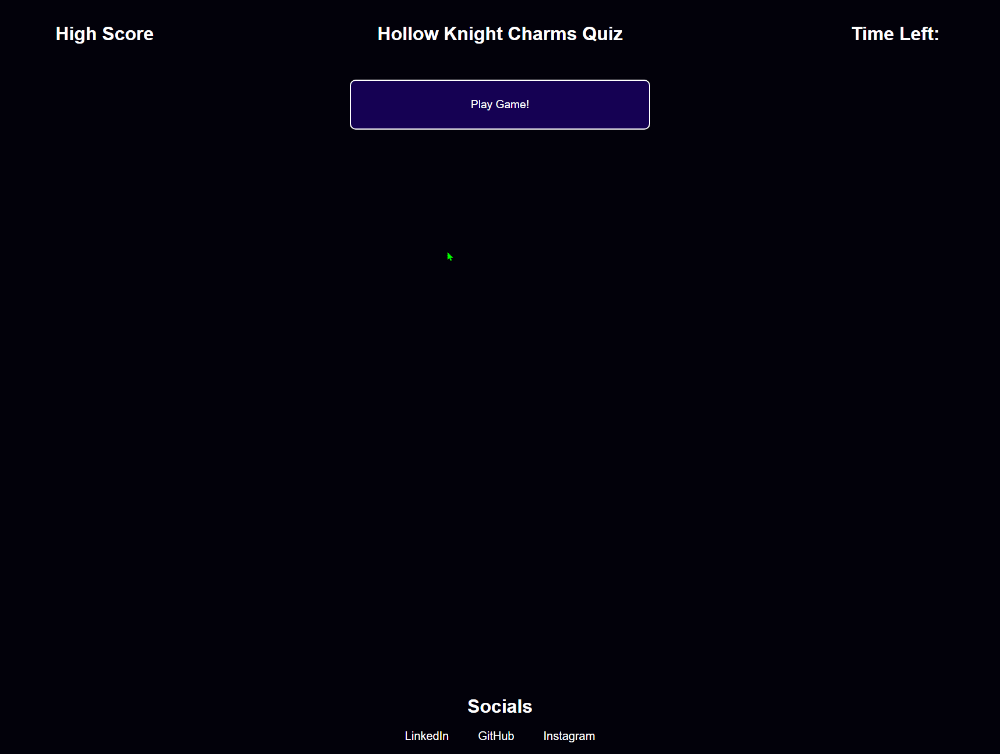

# Hollow Knight Charms Quiz!

## Technology Used 

| Technology Used         | Resource URL           | 
| ------------- |:-------------:| 
| JavaScript | [https://developer.mozilla.org/en-US/docs/Web/JavaScript](https://developer.mozilla.org/en-US/docs/Web/JavaScript)     |  
| HTML    | [https://developer.mozilla.org/en-US/docs/Web/HTML](https://developer.mozilla.org/en-US/docs/Web/HTML) | 
| CSS     | [https://developer.mozilla.org/en-US/docs/Web/CSS](https://developer.mozilla.org/en-US/docs/Web/CSS)      |   
| Git | [https://git-scm.com/](https://git-scm.com/)     |    

---------

## Description

[Visit the Deployed Site](https://daevidvo.github.io/HollowKnight_Quiz_js/)

Test your knowledge on the various charms in Hollow Knight!

I love the game and thought it'd be great to make a tiny game out of an essential part of the Hollow Knight experience using mainly JS and WebAPIs!

Through changing the HTML elements and information through JS, this website is dynamically generated. 



--------

## Table of Contents 

* [Technology Used](#technology-used)
* [Description](#description)
* [Dynamic HTML Example](#dynamic-html-example)
* [Usage and Installation](#usage-and-installation)
* [Learning Points](#learning-points)
* [Author Info](#author-info)
* [Credits](#credits)
* [License](#license)

--------

## Dynamic HTML Example

Through the use of JavaScript, I'm able to change the text of the buttons to correspond with the correct question or game function as seen in the example below!

HTML:

``` html
<button type="button" class="gameButton" id="gameButton0"></button>

<button type="button" class="gameButton" id="gameButton1"></button>

<button type="button" class="gameButton" id="gameButton2"></button>

<button type="button" class="gameButton" id="gameButton3"></button>
```

Corresponding JavaScript:

``` JavaScript
function question3() {
    questionText.textContent = "What does the Dream Wielder charm do?";
    charmsImg.setAttribute("src", "https://static.wikia.nocookie.net/hollowknight/images/9/94/Dream_Wielder.png/revision/latest?cb=20180909170602");

    q3buttonText(); //calls on the function to change the button text

    correctAnswer = gameButton3;

    for (let x=0;x<4;x=x+1) {
        showGameButtons = document.querySelector(`#gameButton${x}`);
        showGameButtons.removeEventListener("click", q2AnswerFunc);
        showGameButtons.addEventListener("click", q3AnswerFunc);
    }
};

function q3buttonText() { //sets the button text
    gameButton0.textContent = "Sends Player to Colosseum of Fools";
    gameButton1.textContent = "Increases Infection Rate";
    gameButton2.textContent = "Summons a Pet";
    gameButton3.textContent = "Gives the Player a Dream Nail";
};
```

--------

## Usage and Installation

If you'd like to take the quiz, simply visit [the deployed github page](https://daevidvo.github.io/HollowKnight_Quiz_js/) OR download the files and run index.html in your web browser

------

## Learning Points

Using localStorage to save user information is a great way to save work in the future!

With localStorage, it allows webpages to be even more dynamic and interactive for the user.

-------

## Author Info

### **David Vo**

* [Github](github.com/daevidvo)
* [LinkedIn](linkedin.com/in/daevidvo)
* [Instagram](instagram.com/daevidvo)


-------

## Credits

* [Game Over Gif](https://media.tenor.com/mAG1m_7eazsAAAAd/hollow-knight-dance.gif)
* Visit the [Hollow Knight Website](https://www.hollowknight.com/)
* [Hollow Knight Charms Fandom Page](https://hollowknight.fandom.com/wiki/Category:Charms)


---------

## License

MIT License

Copyright (c) 2023 daevidvo

Permission is hereby granted, free of charge, to any person obtaining a copy
of this software and associated documentation files (the "Software"), to deal
in the Software without restriction, including without limitation the rights
to use, copy, modify, merge, publish, distribute, sublicense, and/or sell
copies of the Software, and to permit persons to whom the Software is
furnished to do so, subject to the following conditions:

The above copyright notice and this permission notice shall be included in all
copies or substantial portions of the Software.

THE SOFTWARE IS PROVIDED "AS IS", WITHOUT WARRANTY OF ANY KIND, EXPRESS OR
IMPLIED, INCLUDING BUT NOT LIMITED TO THE WARRANTIES OF MERCHANTABILITY,
FITNESS FOR A PARTICULAR PURPOSE AND NONINFRINGEMENT. IN NO EVENT SHALL THE
AUTHORS OR COPYRIGHT HOLDERS BE LIABLE FOR ANY CLAIM, DAMAGES OR OTHER
LIABILITY, WHETHER IN AN ACTION OF CONTRACT, TORT OR OTHERWISE, ARISING FROM,
OUT OF OR IN CONNECTION WITH THE SOFTWARE OR THE USE OR OTHER DEALINGS IN THE
SOFTWARE.
